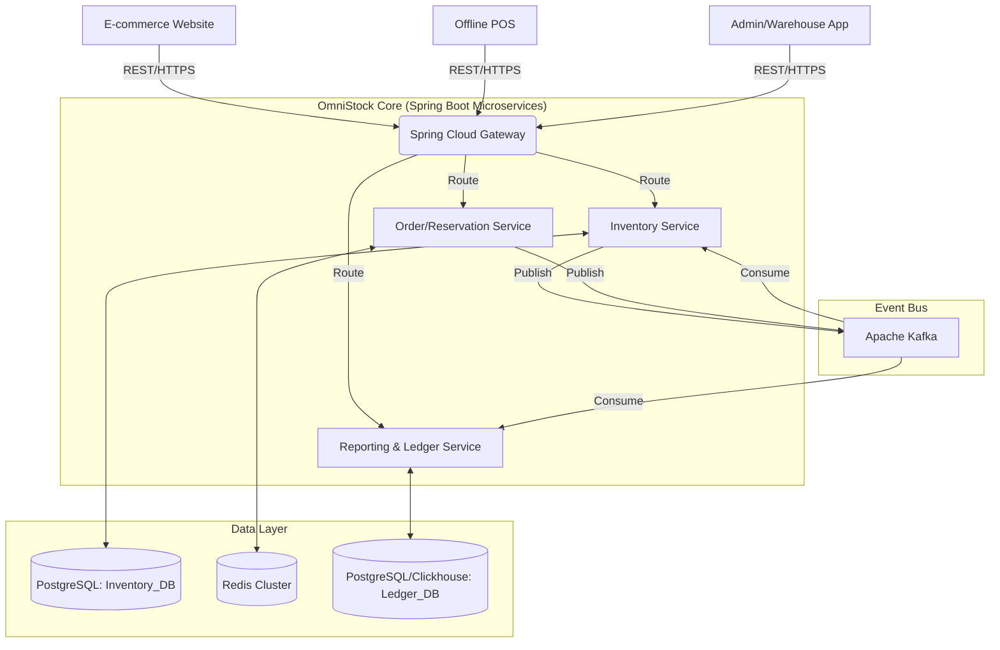
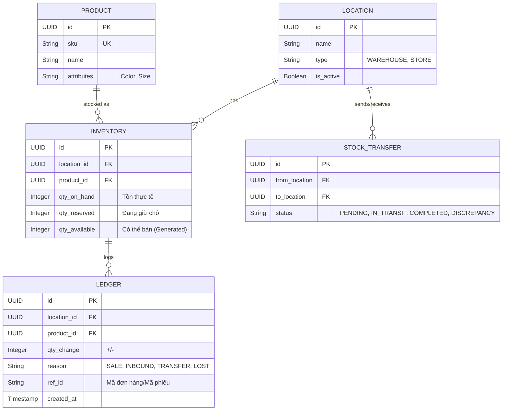

# 🛠 OMNISTOCK - Technical Design Document (TDD)

**Version:** 1.0.0
**Author:** Backend/Solutions Architect
**Status:** Approved for Implementation
**Tech Stack:** Java 17+, Spring Boot 3.x, PostgreSQL, Redis, Apache Kafka

---

## 1. TỔNG QUAN KIẾN TRÚC (HIGH-LEVEL ARCHITECTURE)

Với yêu cầu chịu tải Peak time 1,000 req/s, đảm bảo tính khả dụng cao (báo cáo sập không ảnh hưởng bán hàng), chúng ta sẽ áp dụng kiến trúc **Microservices** (hoặc Modular Monolith chia context rõ ràng) kết hợp **Event-Driven Architecture (EDA)**.

### 1.1. System Architecture Diagram (Mermaid)



### 1.2. Tech Stack Core
*   **API Gateway:** Spring Cloud Gateway (Non-blocking, Rate Limiting).
*   **Core Services:** Spring Boot 3.x (Spring Web, Spring Data JPA).
*   **Primary Database:** PostgreSQL (ACID compliance, Table Partitioning cho Ledger).
*   **Caching & Distributed Lock:** Redis (Redisson Client) + Lua Scripting.
*   **Message Broker:** Apache Kafka (Spring Kafka) để xử lý Event-driven & Async Ledger.
*   **Security:** Spring Security + JWT.

---

## 2. DATABASE DESIGN (ERD)

Mô hình dữ liệu cần giải quyết triệt để vấn đề: Tồn kho thực tế (On-hand), Tồn kho giữ chỗ (Reserved), Tồn kho khả dụng (Available) và Hàng đi đường (In Transit).

### 2.1. Công thức Tồn Kho Cốt Lõi
`Quantity_Available = Quantity_OnHand - Quantity_Reserved`

### 2.2. Sơ đồ Thực thể (Mermaid ERD)



---

## 3. THIẾT KẾ GIẢI PHÁP CHO CÁC LUỒNG NGHIỆP VỤ (USE CASES)

### 3.1. Bài toán: Giữ kho & Tránh Overselling (E-commerce 1000 req/s)

**Vấn đề:** Nếu dùng Database (Pessimistic Lock) để trừ kho với 1000 req/s, DB sẽ bị lock và crash.
**Giải pháp:** Sử dụng **Redis Lua Script** để xử lý nguyên tử (Atomic) kết hợp **Asynchronous DB Update**.

*Luồng thực thi (Reserve Stock):*
1. E-commerce gọi API `POST /api/v1/inventory/reserve`
2. Spring Boot dùng Redisson gửi Lua Script lên Redis.
   *Lua script logic:* Kiểm tra `Available > requested_qty`. Nếu ĐÚNG: `Available = Available - req`, `Reserved = Reserved + req`.
3. Nếu Redis trả về SUCCESS -> Spring Boot đẩy 1 Event `StockReservedEvent` vào Kafka. Trả về 200 OK cho E-com ngay lập tức (< 50ms).
4. Kafka Consumer ở DB Layer âm thầm đọc Event và update DB PostgreSQL (`qty_reserved += req`).

*Luồng nhả kho (Cancel) hoặc Hoàn thành (Complete):*
*   **Hoàn thành:** Trừ `qty_on_hand`, trừ `qty_reserved` ở cả Redis và DB.
*   **Hủy đơn:** Cộng lại `qty_available`, trừ `qty_reserved` ở cả Redis và DB.

### 3.2. Bài toán: Luân chuyển hàng hóa & In Transit

Sử dụng State Machine (Spring State Machine hoặc trạng thái logic thủ công) cho `STOCK_TRANSFER`:

1. **Tạo phiếu (PENDING):** Kho tổng chuẩn bị hàng.
2. **Xuất kho (IN_TRANSIT):**
    * Trừ `qty_on_hand` tại Kho Tổng.
    * Tạo 1 bản ghi `LEDGER` (Type: TRANSFER_OUT).
    * Sinh ra Event `StockInTransitEvent`. (Hàng lúc này nằm trong bảng `STOCK_TRANSFER` chi tiết, không nằm ở kho nào cả).
3. **Nhận hàng (COMPLETED / DISCREPANCY):**
    * Cửa hàng xác nhận nhận. Nếu nhận đủ -> Cộng `qty_on_hand` tại Cửa hàng. Ghi `LEDGER` (Type: TRANSFER_IN).
    * Nếu gửi 100 nhận 98:
        * Cộng 98 vào `qty_on_hand` Cửa hàng.
        * Tạo 2 records `LEDGER`: 1 cái TRANSFER_IN (98), 1 cái DISCREPANCY (2).
        * Cập nhật trạng thái phiếu là `DISCREPANCY`, auto-trigger cảnh báo lên Slack/Email cho Quản lý.

### 3.3. Bài toán: Sổ cái (Ledger) & Audit - Không thể tẩy xóa

*   Bảng `LEDGER` trong PostgreSQL được thiết kế là **Append-Only** (Chỉ thêm mới).
*   Tại tầng Database, thu hồi quyền `UPDATE` và `DELETE` trên bảng này đối với Application DB User.
*   Sử dụng **Table Partitioning** theo tháng (vd: `ledger_2023_11`) để đảm bảo truy vấn nhanh khi dữ liệu phình to lên hàng triệu dòng.
*   Mọi thay đổi tồn kho đều phải được trigger từ Ledger (Event Sourcing pattern) hoặc ghi song song trong 1 Local Transaction (Spring `@Transactional`).

### 3.4. Bài toán: Kiểm kê (Stocktake) mà không dừng bán hàng

**Giải pháp:** Snapshot Isolation & Delta Calculation.
1. Nhân viên quét mã bắt đầu kiểm kê: Hệ thống chốt **Snapshot Qty** tại thời điểm T0 (Ví dụ: DB ghi nhận có 100 cái).
2. Trong lúc đếm, cửa hàng bán được 5 cái. Hệ thống bán hàng vẫn trừ kho bình thường (DB On-hand còn 95). Log Ledger ghi nhận 5 giao dịch bán.
3. Nhân viên đếm xong thực tế là 98 cái ở thời điểm T1 (nghĩa là lúc T0 bị mất 2 cái).
4. Khi Submit: Hệ thống tính toán độ lệch: `Delta = Thực đếm (98) - Snapshot (100) = -2`.
5. Hệ thống áp dụng Delta vào tồn kho hiện tại: `New_On_Hand = Current DB (95) + Delta (-2) = 93`.
6. Ghi Ledger: `Stocktake Adjustment: -2`.

---

## 4. CHI TIẾT API CỐT LÕI (API CONTRACTS)

Dưới đây là một số API spec cho team Frontend/E-com tích hợp.

### 4.1. Check Availability (Tối ưu < 200ms)
*   **Endpoint:** `GET /api/v1/inventory/availability`
*   **Routing:** Cắm thẳng vào Redis (Cache Aside pattern).
*   **Query Params:** `sku`, `location_id`
*   **Response:**
    ```json
    {
      "sku": "TSHIRT-BLK-XL",
      "location_id": "loc-uuid-123",
      "available_qty": 45,
      "updated_at": "2023-11-01T10:00:00Z"
    }
    ```

### 4.2. Reserve Stock (Flash Sale - High Concurrency)
*   **Endpoint:** `POST /api/v1/inventory/reserve`
*   **Body:**
    ```json
    {
      "order_ref": "ECOM-998877",
      "items": [
        { "sku": "TSHIRT-BLK-XL", "qty": 2, "location_id": "loc-uuid-123" }
      ]
    }
    ```
*   **Response:** `200 OK` (Nếu thành công) hoặc `409 Conflict` (Nếu `INSUFFICIENT_STOCK`).

---

## 5. HƯỚNG DẪN THỰC THI CHO SOFTWARE ENGINEERS

Để build hệ thống này, team cần chú ý các kỹ thuật sau trong Spring:

1. **Redis Lua Scripting:** Dùng `StringRedisTemplate` hoặc `Redisson` để execute script. Không dùng phép toán `GET` rồi `SET` ở tầng Java code để tránh Race Condition.
   ```lua
   -- Example Lua Script for Reservation
   local available = tonumber(redis.call('HGET', KEYS[1], 'available'))
   local qty = tonumber(ARGV[1])
   if available >= qty then
       redis.call('HINCRBY', KEYS[1], 'available', -qty)
       redis.call('HINCRBY', KEYS[1], 'reserved', qty)
       return 1
   else
       return 0
   end
   ```

2. **Distributed Transaction (Saga Pattern):** Vì có Kafka, nếu Service Order tạo đơn thành công, gọi Inventory báo Reserve thành công. Nhưng nếu thanh toán lỗi, Order Service phải gửi Event `OrderFailed` để Inventory Service rollback (nhả Redis, nhả DB).

3. **Idempotency (Tính lũy đẳng):** E-commerce có thể retry gọi API Reserve nhiều lần do network lag. Phải dùng `order_ref` làm Idempotency Key lưu vào Redis/DB để đảm bảo không trừ kho 2 lần cho 1 đơn hàng.

4. **Database Migration:** Bắt buộc dùng **Flyway** hoặc **Liquibase** để quản lý versioning cho DB Schema (nhất là việc setup Table Partition cho Ledger).

## 6. LỘ TRÌNH TRIỂN KHAI (Dành cho DevOps / Tương lai)

*   **Phase 1 (Go-live chuẩn):** Deploy các Spring Boot services lên Kubernetes (EKS/GKE). Setup 3 nodes Redis Cluster, 3 nodes Kafka.
*   **Phase 2 (Webhook cho GHTK/ViettelPost):** Sẽ viết thêm 1 module `Integration-Service` nhận Webhook, khi có status "Giao thành công", bắn Kafka event `OrderDelivered` -> Inventory tự động chuyển từ Reserve sang Trừ On-hand.
*   **Phase 3 (Scale 50 cửa hàng):** Tăng số lượng Pods của Inventory Service, Redis lúc này làm Cache phân tán sẽ chịu được lượng Read cực lớn từ Cửa hàng + Web.

---
**Tài liệu này là "Source of Truth" cho team Kỹ thuật. Đề nghị các Engineers đọc kỹ phần Lua Script và Event-Driven trước khi code.** Mọi thắc mắc về luồng Data hãy comment trực tiếp vào Pull Request hoặc Jira Ticket tương ứng.