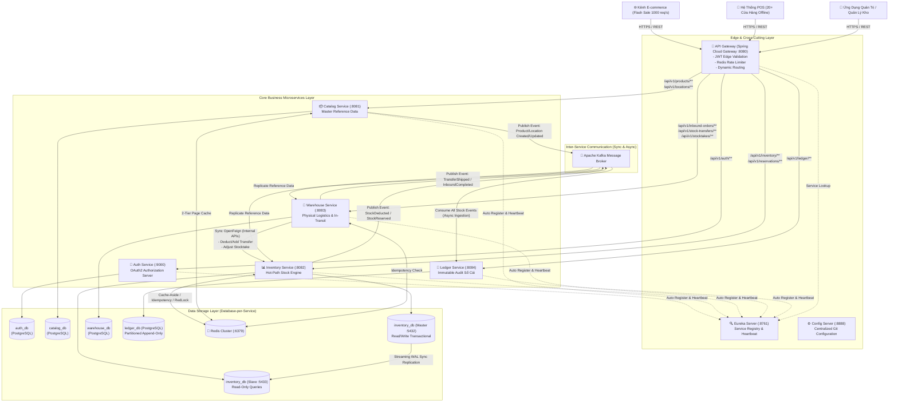
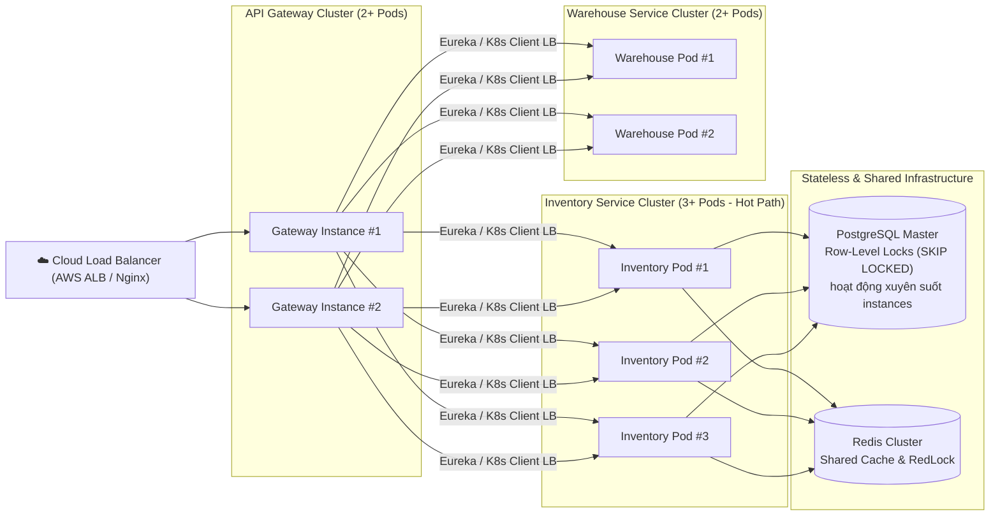
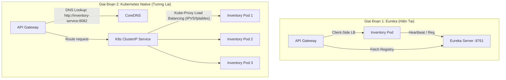
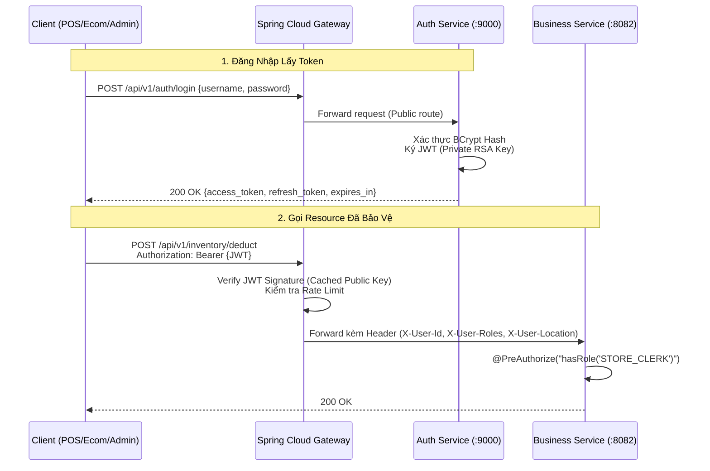
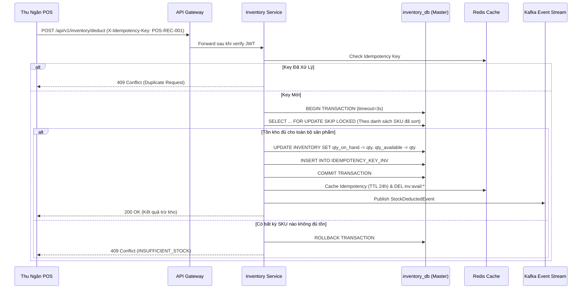
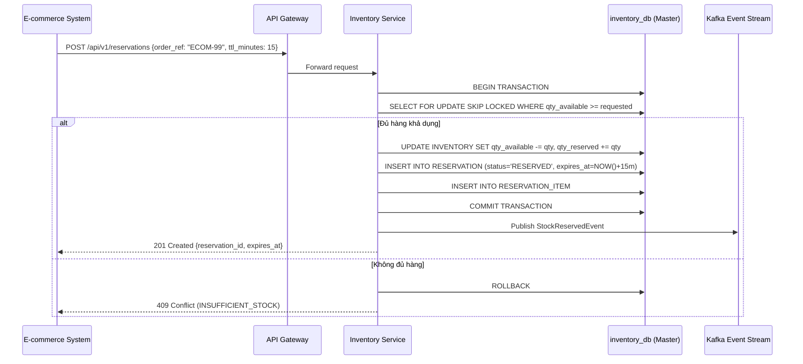

# 🛠 OMNISTOCK - Enterprise Technical Design Document (TDD)

**Version:** 2.0.0  
**Status:** Approved for Implementation (Production-Ready Architecture)  
**Author:** Senior System & Enterprise Solutions Architect  
**Tech Stack:** Java 21, Spring Boot 4.0.6, Spring Cloud, PostgreSQL 18.4 (Database-per-Service), Redis 8.6.4, Apache Kafka 3.x, Docker Compose / Kubernetes  
**Source Specifications:** [Sample_requirement.md](file:///home/thai_pham/source_code/shelfmanagement/Sample_requirement.md), [api_specification.md](file:///home/thai_pham/source_code/shelfmanagement/api_specification.md)

---

## MỤC LỤC (TABLE OF CONTENTS)

1. [Tổng Quan & Tech Stack (Overview & Technology Stack)](#1-tổng-quan--tech-stack)
2. [Phân Tích Single Responsibility Principle (SRP Analysis)](#2-phân-tích-single-responsibility-principle-srp-analysis)
3. [Kiến Trúc Tổng Thể Hệ Thống (High-Level Architecture)](#3-kiến-trúc-tổng-thể-hệ-thống-high-level-architecture)
4. [Yêu Cầu Phi Chức Năng & Ràng Buộc Kỹ Thuật (NFR & System Constraints)](#4-yêu-cầu-phi-chức-năng--ràng-buộc-kỹ-thuật)
5. [Service Discovery: Eureka & Lộ Trình Chuyển Đổi Kubernetes (K8s Migration Path)](#5-service-discovery-eureka--lộ-trình-chuyển-đổi-kubernetes)
6. [Thiết Kế Database-per-Service & Hướng Dẫn Thiết Lập Chuẩn Best-Practice](#6-thiết-kế-database-per-service--hướng-dẫn-thiết-lập-chuẩn-best-practice)
7. [Thiết Kế Bảo Mật: Spring Security, OAuth2 & RBAC](#7-thiết-kế-bảo-mật-spring-security-oauth2--rbac)
8. [Giao Tiếp Giữa Các Service & Thiết Kế Kafka Events](#8-giao-tiếp-giữa-các-service--thiết-kế-kafka-events)
9. [Thiết Kế Cơ Sở Dữ Liệu Chi Tiết (Database Design - 3NF Normalized)](#9-thiết-kế-cơ-sở-dữ-liệu-chi-tiết-database-design---3nf-normalized)
10. [Chiến Lược Xử Lý Concurrency, Data Integrity & Idempotency](#10-chiến-lược-xử-lý-concurrency-data-integrity--idempotency)
11. [Sơ Đồ Luồng Dữ Liệu & Sequence Diagrams Cho Từng Use Case](#11-sơ-đồ-luồng-dữ-liệu--sequence-diagrams-cho-từng-use-case)
12. [Thiết Kế Chi Tiết Từng Microservice (Service-Level Design)](#12-thiết-kế-chi-tiết-từng-microservice-service-level-design)
13. [Bảng Tra Cứu State Machine, Redis Keys, Bug Audit & Lộ Trình Triển Khai](#13-bảng-tra-cứu-state-machine-redis-keys-bug-audit--lộ-trình-triển-khai)

---

## 1. TỔNG QUAN & TECH STACK

Hệ thống **OmniStock** là giải pháp quản lý tồn kho trung tâm đa kênh (Omni-channel Inventory Management) đóng vai trò làm "Nguồn sự thật duy nhất" (Single Source of Truth) cho toàn bộ chuỗi cung ứng của TechWear VN (1 Kho tổng, 20+ Cửa hàng bán lẻ, và Kênh Thương mại điện tử Flash Sale).

Hệ thống được thiết kế theo mô hình **Cloud-Native Microservices** kết hợp **Event-Driven Architecture (EDA)**, hỗ trợ multi-instance horizontal scaling, đảm bảo tính toàn vẹn dữ liệu tuyệt đối (Zero Negative Stock) và đáp ứng tải cao (Peak 1,000 req/s, phản hồi < 200ms).

### 1.1. Bảng Chi Tiết Technology Stack

| Layer / Component | Technology | Version | Purpose & Implementation Details |
|---|---|---|---|
| **Runtime** | OpenJDK Java | 21 (LTS) | Virtual Threads (Project Loom), Pattern Matching, Record classes |
| **Core Framework** | Spring Boot | 4.0.6 | Core framework, dependency injection, auto-configuration |
| **API Gateway** | Spring Cloud Gateway | 4.x | Non-blocking reactive gateway, Edge JWT validation, Rate Limiting |
| **Service Discovery** | Spring Cloud Netflix Eureka | 4.x | Dynamic service registration/discovery (Local/Cloud VM), có lộ trình sang K8s |
| **Config Management** | Spring Cloud Config Server | 4.x | Git-backed centralized configuration management |
| **Security & Auth** | Spring Authorization Server / Spring Security | 1.x / 6.x | OAuth2 Authorization Server, OpenID Connect, JWT issuance & Resource Server |
| **Data Access / ORM** | Spring Data JPA / Hibernate | 7.x | Object-Relational Mapping, Auditing, Specifications, Optimistic/Pessimistic Locks |
| **Primary Database** | PostgreSQL (Bitnami) | 18.4 | Database-per-Service, Master-Slave Streaming WAL Replication, Partitioning |
| **Distributed Cache & Lock** | Redis & Redisson | 8.6.4 / 3.x | Cache-Aside, Distributed Lock (RedLock), Redis Idempotency, Rate Limiting |
| **Event Bus / Message Broker** | Apache Kafka | 3.x | Event Sourcing, Asynchronous Inter-Service Communication, Audit Event Stream |
| **Inter-Service Sync Call** | Spring Cloud OpenFeign | 4.x | Declarative REST client with client-side load balancing |
| **Fault Tolerance / Resilience** | Resilience4j | 2.4.0 | Circuit Breaker, Retry, RateLimiter, Bulkhead, TimeLimiter |
| **Distributed Tracing** | OpenTelemetry & Micrometer | 1.65 / 1.6 | W3C Trace Context, Distributed Tracing across Microservices |
| **Logging** | Logstash Logback Encoder / ELK | 9.0 | Structured JSON logging, Masking sensitive PII |
| **API Documentation** | SpringDoc OpenAPI (Swagger) | 2.8.5 | RFC 7807 problem details, Interactive OpenAPI UI per service |
| **Database Migration** | Flyway | 10.x | Per-service incremental schema version control |
| **Container & Orchestration** | Docker Compose / Kubernetes | 3.9 / v1.30+ | Local development via Docker Compose, Cloud production via Kubernetes |

---

## 2. PHÂN TÍCH SINGLE RESPONSIBILITY PRINCIPLE (SRP ANALYSIS)

Trong kiến trúc Microservices enterprise, việc phân rã hệ thống thành các service độc lập phải tuân thủ nghiêm ngặt **Single Responsibility Principle (SRP)**: *Mỗi service chỉ có một lý do duy nhất để thay đổi (One single reason to change)* và đại diện cho một **Bounded Context** rõ ràng trong Domain-Driven Design (DDD).

### 2.1. SRP Audit Từng Service

```
┌───────────────────────────────────────────────────────────────────────────────────────────────────┐
│                                   SRP AUDIT & BOUNDED CONTEXT                                     │
├───────────────────┬───────────────────────────────┬───────────────────────────────────────────────┤
│ Microservice      │ Single Responsibility         │ Duy Nhất 1 Lý Do Để Thay Đổi (Reason to Change)│
├───────────────────┼───────────────────────────────┼───────────────────────────────────────────────┤
│ API Gateway       │ Routing & Edge Security       │ Thay đổi routing rule, CORS, Rate Limit policy│
├───────────────────┼───────────────────────────────┼───────────────────────────────────────────────┤
│ Auth Service      │ Identity & Access Management  │ Thay đổi cơ chế đăng nhập, RBAC, OAuth2/OIDC  │
├───────────────────┼───────────────────────────────┼───────────────────────────────────────────────┤
│ Catalog Service   │ Master Data Management        │ Thay đổi schema Product, Location attributes  │
├───────────────────┼───────────────────────────────┼───────────────────────────────────────────────┤
│ Inventory Service │ Stock Quantity State & Locks  │ Thay đổi thuật toán tính tồn, concurrency lock│
├───────────────────┼───────────────────────────────┼───────────────────────────────────────────────┤
│ Warehouse Service │ Physical Goods Movement Flows │ Thay đổi quy trình luân chuyển/nhập/kiểm kê   │
├───────────────────┼───────────────────────────────┼───────────────────────────────────────────────┤
│ Ledger Service    │ Immutable Stock Audit Trail   │ Thay đổi chính sách lưu trữ sổ cái/partition  │
└───────────────────┴───────────────────────────────┴───────────────────────────────────────────────┘
```

### 2.2. SRP Decision Log: Tại Sao Nhóm & Tại Sao Tách?

#### Q1: Tại sao Product và Location được quản lý trong cùng Catalog Service?
*   **Lý do nhóm:** Cả hai đều thuộc Bounded Context **"Master/Reference Data"**, có tần suất cập nhật cực thấp (vài lần/ngày), cùng đối tượng vận hành (Admin), và không chịu áp lực concurrency lớn.
*   **Khi nào tách:** Khi hệ thống bổ sung tính năng GIS/Bản đồ phức tạp cho Location hoặc Search Engine chuyên sâu (Elasticsearch) cho Product Catalog.

#### Q2: Tại sao Inventory và Reservation nằm trong cùng Inventory Service?
*   **Lý do nhóm:** Thao tác Reservation trực tiếp biến đổi trạng thái số lượng của `INVENTORY` (`qty_available` giảm, `qty_reserved` tăng) và cùng nằm trên hot-path Flash Sale (1000 req/s). Việc đặt chung service cho phép thực thi trong cùng 1 Local Transaction với Pessimistic Lock trên PostgreSQL, loại bỏ hoàn toàn độ trễ mạng và rủi ro Distributed Transaction không cần thiết.
*   **Khi nào tách:** Khi logic Checkout/Reservation phát triển thành quy trình phức tạp nhiều bước (Payment Gateway, Fraud Detection, Voucher Allocation).

#### Q3: Tại sao Inbound Order, Stock Transfer và Stocktake nằm trong Warehouse Service?
*   **Lý do nhóm:** Cả 3 đều thuộc Bounded Context **"Physical Operations"** do Thủ kho / Quản lý kho phụ trách. Cả 3 nghiệp vụ đều theo quy trình: Tạo phiếu (Draft) -> Thực thi -> Xác nhận -> Đồng bộ kho -> Ghi Ledger.
*   **Khi nào tách:** Khi quy trình Luân chuyển (Transfer) tích hợp đa chặng với Đơn vị vận chuyển thứ 3 (3PL) phức tạp hoặc Stocktake chuyển sang kiến trúc Mobile Offline-First.

#### Q4: Tại sao Ledger Service phải tách riêng biệt hoàn toàn?
*   **Lý do tách:** 
    1. **Mô hình ghi đặc biệt:** Ledger là **Append-Only** (nghiêm cấm `UPDATE`, `DELETE`).
    2. **Khối lượng dữ liệu lớn:** Mọi thay đổi tồn kho đều phát sinh bản ghi Ledger, bảng phình to nhanh chóng và đòi hỏi Partitioning theo tháng.
    3. **Tính sẵn sàng cao (High Availability):** Nếu Ledger Service sập, các luồng bán lẻ và trừ tồn kho tại POS/Web **vẫn phải hoạt động bình thường** (qua Kafka Buffer).

### 2.3. Bảng Ma Trận Phân Quyền Trách Nhiệm (Responsibility Matrix)

```
┌───────────────────────────┬──────────┬──────┬─────────┬───────────┬───────────┬────────┐
│ Nghiệp Vụ Cụ Thể          │ Gateway  │ Auth │ Catalog │ Inventory │ Warehouse │ Ledger │
├───────────────────────────┼──────────┼──────┼─────────┼───────────┼───────────┼────────┤
│ Request Routing           │    ●     │      │         │           │           │        │
│ Rate Limiting             │    ●     │      │         │           │           │        │
│ Token Issuance & Refresh  │          │  ●   │         │           │           │        │
│ User / Role / RBAC Mgmt   │          │  ●   │         │           │           │        │
│ Product Master CRUD       │          │      │    ●    │           │           │        │
│ Location Master CRUD      │          │      │    ●    │           │           │        │
│ Real-time Stock Query     │          │      │         │     ●     │           │        │
│ Availability Fast-Check   │          │      │         │     ●     │           │        │
│ POS Instant Deduction     │          │      │         │     ●     │           │        │
│ Reservation Hold/Confirm  │          │      │         │     ●     │           │        │
│ Inbound Orders (Supplier) │          │      │         │           │     ●     │        │
│ Stock Transfers (Transit) │          │      │         │           │     ●     │        │
│ Stocktake (Physical Count)│          │      │         │           │     ●     │        │
│ Audit Trail Ingestion     │          │      │         │           │           │   ●    │
│ Audit Trail Reporting     │          │      │         │           │           │   ●    │
└───────────────────────────┴──────────┴──────┴─────────┴───────────┴───────────┴────────┘
● = Đơn vị sở hữu duy nhất (Single Owner)
```

---

## 3. KIẾN TRÚC TỔNG THỂ HỆ THỐNG (HIGH-LEVEL ARCHITECTURE)

### 3.1. Sơ Đồ Kiến Trúc Toàn Cảnh (Mermaid System Architecture)


```mermaid
graph TD
    Client_Ecom["🌐 Kênh E-commerce (Flash Sale 1000 req/s)"] -->|HTTPS / REST| API_GW
    Client_POS["🏪 Hệ Thống POS (20+ Cửa Hàng Offline)"] -->|HTTPS / REST| API_GW
    Client_Admin["👤 Ứng Dụng Quản Trị / Quản Lý Kho"] -->|HTTPS / REST| API_GW

    subgraph "Edge & Cross-Cutting Layer"
        API_GW["🚪 API Gateway (Spring Cloud Gateway :8080)<br/>- JWT Edge Validation<br/>- Redis Rate Limiter<br/>- Dynamic Routing"]
        Eureka["🔍 Eureka Server (:8761)<br/>Service Registry & Heartbeat"]
        ConfigSvr["⚙️ Config Server (:8888)<br/>Centralized Git Configuration"]
    end

    subgraph "Core Business Microservices Layer"
        API_GW -->|"/api/v1/auth/**"| Svc_Auth["🔐 Auth Service (:9000)<br/>OAuth2 Authorization Server"]
        API_GW -->|"/api/v1/products/**<br/>/api/v1/locations/**"| Svc_Cat["📦 Catalog Service (:8081)<br/>Master Reference Data"]
        API_GW -->|"/api/v1/inventory/**<br/>/api/v1/reservations/**"| Svc_Inv["📊 Inventory Service (:8082)<br/>Hot-Path Stock Engine"]
        API_GW -->|"/api/v1/inbound-orders/**<br/>/api/v1/stock-transfers/**<br/>/api/v1/stocktakes/**"| Svc_WH["🚚 Warehouse Service (:8083)<br/>Physical Logistics & In-Transit"]
        API_GW -->|"/api/v1/ledger/**"| Svc_Ledger["📒 Ledger Service (:8084)<br/>Immutable Audit Sổ Cái"]
    end

    Svc_Auth & Svc_Cat & Svc_Inv & Svc_WH & Svc_Ledger -.->|Auto Register & Heartbeat| Eureka
    API_GW -.->|Service Lookup| Eureka

    subgraph "Inter-Service Communication (Sync & Async)"
        Svc_WH -->|"Sync OpenFeign (Internal APIs)<br/>- Deduct/Add Transfer<br/>- Adjust Stocktake"| Svc_Inv
        Svc_Cat -->|"Publish Event: Product/Location Created/Updated"| Kafka["📨 Apache Kafka Message Broker"]
        Svc_Inv -->|"Publish Event: StockDeducted / StockReserved"| Kafka
        Svc_WH -->|"Publish Event: TransferShipped / InboundCompleted"| Kafka
        Kafka -->|"Replicate Reference Data"| Svc_Inv
        Kafka -->|"Replicate Reference Data"| Svc_WH
        Kafka -->|"Consume All Stock Events (Async Ingestion)"| Svc_Ledger
    end

    subgraph "Data Storage Layer (Database-per-Service)"
        Svc_Auth --> DB_Auth[("auth_db<br/>(PostgreSQL)")]
        Svc_Cat --> DB_Cat[("catalog_db<br/>(PostgreSQL)")]
        Svc_Inv --> DB_Inv_Master[("inventory_db (Master :5432)<br/>Read/Write Transactional")]
        Svc_Inv --> DB_Inv_Slave[("inventory_db (Slave :5433)<br/>Read-Only Queries")]
        DB_Inv_Master -->|"Streaming WAL Sync Replication"| DB_Inv_Slave
        Svc_WH --> DB_WH[("warehouse_db<br/>(PostgreSQL)")]
        Svc_Ledger --> DB_Ledger[("ledger_db (PostgreSQL)<br/>Partitioned Append-Only")]
        Svc_Inv <-->|"Cache-Aside / Idempotency / RedLock"| Redis[("🔴 Redis Cluster (:6379)")]
        Svc_Cat <-->|"2-Tier Page Cache"| Redis
        Svc_WH <-->|"Idempotency Check"| Redis
    end
```

### 3.2. Mô Hình Multi-Instance Cloud Deployment

Khi triển khai trên Cloud (Kubernetes hoặc Multi-VM), mỗi microservice được cấu hình chạy tối thiểu 2-3 instances để loại bỏ Single Point of Failure (SPOF) và cân bằng tải.


```mermaid
graph LR
    Cloud_LB["☁️ Cloud Load Balancer (AWS ALB / Nginx)"]

    subgraph "API Gateway Cluster (2+ Pods)"
        GW1["Gateway Instance #1"]
        GW2["Gateway Instance #2"]
    end

    subgraph "Inventory Service Cluster (3+ Pods - Hot Path)"
        INV1["Inventory Pod #1"]
        INV2["Inventory Pod #2"]
        INV3["Inventory Pod #3"]
    end

    subgraph "Warehouse Service Cluster (2+ Pods)"
        WH1["Warehouse Pod #1"]
        WH2["Warehouse Pod #2"]
    end

    Cloud_LB --> GW1 & GW2
    GW1 & GW2 -->|"Eureka / K8s Client LB"| INV1 & INV2 & INV3
    GW1 & GW2 -->|"Eureka / K8s Client LB"| WH1 & WH2

    subgraph "Stateless & Shared Infrastructure"
        Shared_PG[("PostgreSQL Master<br/>Row-Level Locks (SKIP LOCKED)<br/>hoạt động xuyên suốt instances")]
        Shared_Redis[("Redis Cluster<br/>Shared Cache & RedLock")]
    end

    INV1 & INV2 & INV3 --> Shared_PG
    INV1 & INV2 & INV3 --> Shared_Redis
```

---

## 4. YÊU CẦU PHI CHỨC NĂNG & RÀNG BUỘC KỸ THUẬT

| Mã | Tên Yêu Cầu / Ràng Buộc | Tiêu Chuẩn Kỹ Thuật (SLA / Metrics) | Giải Pháp Kiến Trúc Thực Thi |
|---|---|---|---|
| **NFR-01** | **Zero Negative Stock** | Tồn kho thực tế và khả dụng tuyệt đối $\ge 0$ | DB `CHECK (qty_on_hand >= 0)`, `CHECK (qty_available >= 0)` + Lock `FOR UPDATE` |
| **NFR-02** | **Availability Check SLA** | Thời gian phản hồi API P99 < 200ms với 1,000 req/s | Redis Cache-Aside + Slave DB Replica Read Routing |
| **NFR-03** | **Fast Reservation** | Giữ kho Flash Sale thành công trong < 50ms | Pessimistic Lock có timeout (3s) + Deadlock Prevention (Sort SKU) |
| **NFR-04** | **High Availability** | Khả dụng độc lập: Ledger/Report sập không ảnh hưởng bán hàng | Phân tách Service, Kafka làm bộ đệm bất đồng bộ (Decoupling) |
| **NFR-05** | **Immutable Audit Trail** | Nhật ký sổ cái không thể bị sửa, xóa hay ghi đè | Thu hồi quyền `UPDATE`, `DELETE` trên bảng `LEDGER_ENTRY` từ database user |
| **NFR-06** | **Idempotent Mutations** | Tránh lặp giao dịch khi client retry mạng | Header `X-Idempotency-Key` + Cơ chế kiểm tra 2 lớp Redis (Fast) & DB (Durable) |
| **NFR-07** | **Atomic POS Checkout** | Bán tại quầy trừ kho toàn bộ hoặc thất bại toàn bộ | Single Local DB Transaction (`@Transactional(isolation = READ_COMMITTED)`) |
| **NFR-08** | **Concurrent Stocktake** | Cửa hàng vẫn được bán hàng trong khi nhân viên kiểm kho | Thuật toán Snapshot Isolation + Delta Calculation |
| **NFR-09** | **Configurable TTL** | Hạn giữ kho có thể điều chỉnh linh hoạt (mặc định 30p) | Request parameter `ttl_minutes` + Background Expire Scheduler với RedLock |
| **NFR-10** | **Catalog Scale Target** | 50,000 SKUs, 21 $\rightarrow$ 71 địa điểm kho/cửa hàng | Đánh Index B-Tree, Trigram GIN Index trên SKU và Name |

---

## 5. SERVICE DISCOVERY: EUREKA & LỘ TRÌNH CHUYỂN ĐỔI KUBERNETES

### 5.1. Cấu Hình Hiện Tại: Spring Cloud Netflix Eureka

Sử dụng cho môi trường Local Docker Compose và Cloud VM.

#### Cấu hình Eureka Server (`eureka-server/src/main/resources/application.yml`):
```yaml
server:
  port: 8761
spring:
  application:
    name: eureka-server
eureka:
  instance:
    hostname: eureka-server
  client:
    register-with-eureka: false
    fetch-registry: false
  server:
    enable-self-preservation: true
    eviction-interval-timer-in-ms: 5000
    renewal-percent-threshold: 0.85
```

#### Cấu hình Eureka Client trên các Microservice:
```yaml
eureka:
  client:
    service-url:
      defaultZone: http://${EUREKA_HOST:eureka-server}:8761/eureka/
    registry-fetch-interval-seconds: 5
  instance:
    prefer-ip-address: true
    lease-renewal-interval-in-seconds: 10
    lease-expiration-duration-in-seconds: 30
```

### 5.2. Lộ Trình Di Chuyển Lên Kubernetes Native Service Discovery (K8s Migration)


```mermaid
graph TD
    subgraph "Giai Đoạn 1: Eureka (Hiện Tại)"
        SvcA1["Inventory Pod"] -->|"Heartbeat / Reg"| Eur["Eureka Server :8761"]
        GW1["API Gateway"] -->|"Fetch Registry"| Eur
        GW1 -->|"Client-Side LB"| SvcA1
    end

    subgraph "Giai Đoạn 2: Kubernetes Native (Tương Lai)"
        GW2["API Gateway"] -->|"DNS Lookup: http://inventory-service:8082"| K8s_DNS["CoreDNS"]
        GW2 -->|"Route request"| K8s_Svc["K8s ClusterIP Service"]
        K8s_Svc -->|"Kube-Proxy Load Balancing (IPVS/Iptables)"| Pod1["Inventory Pod 1"]
        K8s_Svc --> Pod2["Inventory Pod 2"]
        K8s_Svc --> Pod3["Inventory Pod 3"]
    end
```

---

## 6. THIẾT KẾ DATABASE-PER-SERVICE & HƯỚNG DẪN THIẾT LẬP CHUẨN BEST-PRACTICE

Mỗi Microservice sở hữu **riêng biệt 1 Logical Database**. Không có bất kỳ truy vấn cross-database SQL JOIN nào được phép thực thi.

### 6.1. Docker Compose Multi-Database Setup (`compose.yaml`)

(Xem chi tiết cấu hình container trong phần 6.1 tại [update_plan.md](file:///home/thai_pham/source_code/shelfmanagement/update_plan.md))

### 6.2. Cấu Trúc Quản Lý Database Migration (Flyway)

Mỗi service chứa thư mục migration độc lập tại `src/main/resources/db/migration/`:

```
shelfmanagement/
├── auth-service/src/main/resources/db/migration/
│   ├── V1__init_auth_schema.sql
│   └── V2__seed_default_roles.sql
├── catalog-service/src/main/resources/db/migration/
│   ├── V1__init_catalog_schema.sql
│   └── V2__add_trigram_indexes.sql
├── inventoryservice/src/main/resources/db/migration/
│   ├── V1__init_inventory_schema.sql
│   ├── V2__create_replicas_and_idempotency.sql
│   └── V3__add_check_constraints_and_indexes.sql
├── warehouse-service/src/main/resources/db/migration/
│   ├── V1__init_warehouse_schema.sql
│   └── V2__create_discrepancy_and_replicas.sql
└── ledger-service/src/main/resources/db/migration/
    ├── V1__init_ledger_partitioned_table.sql
    └── V2__create_initial_monthly_partitions.sql
```

---

## 7. THIẾT KẾ BẢO MẬT: SPRING SECURITY, OAUTH2 & RBAC

### 7.1. Luồng Xác Thực & Ủy Quyền (Authentication & Authorization Flow)


```mermaid
sequenceDiagram
    participant Client as Client (POS/Ecom/Admin)
    participant GW as Spring Cloud Gateway
    participant Auth as Auth Service (:9000)
    participant Svc as Business Service (:8082)

    Note over Client,Auth: 1. Đăng Nhập Lấy Token
    Client->>GW: POST /api/v1/auth/login {username, password}
    GW->>Auth: Forward request (Public route)
    Auth->>Auth: Xác thực BCrypt Hash<br/>Ký JWT (Private RSA Key)
    Auth-->>Client: 200 OK {access_token, refresh_token, expires_in}

    Note over Client,Svc: 2. Gọi Resource Đã Bảo Vệ
    Client->>GW: POST /api/v1/inventory/deduct<br/>Authorization: Bearer {JWT}
    GW->>GW: Verify JWT Signature (Cached Public Key)<br/>Kiểm tra Rate Limit
    GW->>Svc: Forward kèm Header (X-User-Id, X-User-Roles, X-User-Location)
    Svc->>Svc: @PreAuthorize("hasRole('STORE_CLERK')")
    Svc-->>Client: 200 OK
```

### 7.2. Phân Quyền Role-Based Access Control (RBAC)

1. **`ROLE_ADMIN`:** Toàn quyền trên toàn bộ các endpoint và quản trị người dùng.
2. **`ROLE_WAREHOUSE_MANAGER`:** Quản lý Inbound Order, Stock Transfer, Stocktake, Xem toàn bộ tồn kho.
3. **`ROLE_STORE_CLERK`:** Thực hiện Deduct POS tại cửa hàng của mình, Xác nhận nhận hàng chuyển kho, Thực hiện kiểm kê tại cửa hàng.
4. **`ROLE_ECOMMERCE_SYSTEM`:** Service Account chuyên dụng cho Web/App: Gọi Check Availability, Giữ kho (Reserve), Xác nhận đơn (Confirm), Hủy giữ chỗ (Cancel).

---

## 8. GIAO TIẾP GIỮA CÁC SERVICE & THIẾT KẾ KAFKA EVENTS

### 8.1. Danh Mục Kafka Topics & Cấu Hình Partitions

| Topic Name | Producer | Consumer Group ID | Partitions | Retention | Key |
|---|---|---|---|---|---|
| `catalog.product.events` | Catalog Service | `inventory-catalog-sync`<br/>`warehouse-catalog-sync` | 3 | 7 ngày | `product_id` |
| `catalog.location.events` | Catalog Service | `inventory-location-sync`<br/>`warehouse-location-sync` | 3 | 7 ngày | `location_id` |
| `inventory.stock.events` | Inventory Service | `ledger-stock-consumer` | 6 | 30 ngày | `product_id:location_id` |
| `warehouse.transfer.events`| Warehouse Service | `ledger-warehouse-consumer` | 3 | 30 ngày | `transfer_id` |
| `warehouse.inbound.events` | Warehouse Service | `ledger-warehouse-consumer` | 3 | 30 ngày | `inbound_order_id` |
| `warehouse.stocktake.events`| Warehouse Service | `ledger-warehouse-consumer` | 3 | 30 ngày | `stocktake_id` |

---

## 9. THIẾT KẾ CƠ SỞ DỮ LIỆU CHI TIẾT (DATABASE DESIGN - 3NF NORMALIZED)

### 9.1. DDL Schema Khởi Tạo & Partitioning Bảng Ledger

```sql
-- ====================================================================
-- LEDGER DATABASE: Partitioned Table by Month
-- ====================================================================
CREATE TABLE ledger_entry (
    id UUID DEFAULT gen_random_uuid(),
    location_id UUID NOT NULL,
    product_id UUID NOT NULL,
    sku VARCHAR(100) NOT NULL,
    location_name VARCHAR(255) NOT NULL,
    qty_change INTEGER NOT NULL,
    reason VARCHAR(30) NOT NULL,
    reference_id VARCHAR(255),
    performed_by UUID,
    created_at TIMESTAMPTZ NOT NULL DEFAULT NOW(),
    PRIMARY KEY (id, created_at)
) PARTITION BY RANGE (created_at);

-- Tạo các partition theo tháng
CREATE TABLE ledger_entry_2026_08 PARTITION OF ledger_entry
    FOR VALUES FROM ('2026-08-01 00:00:00+00') TO ('2026-09-01 00:00:00+00');
CREATE TABLE ledger_entry_2026_09 PARTITION OF ledger_entry
    FOR VALUES FROM ('2026-09-01 00:00:00+00') TO ('2026-10-01 00:00:00+00');
CREATE TABLE ledger_entry_2026_10 PARTITION OF ledger_entry
    FOR VALUES FROM ('2026-10-01 00:00:00+00') TO ('2026-11-01 00:00:00+00');

-- Đánh Index tối ưu truy vấn kiểm toán
CREATE INDEX idx_ledger_loc_date ON ledger_entry (location_id, created_at DESC);
CREATE INDEX idx_ledger_prod_date ON ledger_entry (product_id, created_at DESC);
CREATE INDEX idx_ledger_reason ON ledger_entry (reason);

-- BẢO MẬT SỔ CÁI: Nghiêm cấm sửa / xóa đối với application user
REVOKE UPDATE, DELETE, TRUNCATE ON ledger_entry FROM ledger_user;
```

---

## 10. CHIẾN LƯỢC XỬ LÝ CONCURRENCY, DATA INTEGRITY & IDEMPOTENCY

### 10.1. Chiến Lược Pessimistic Locking Với `SKIP LOCKED`

```java
@Repository
public interface InventoryRepository extends JpaRepository<Inventory, UUID> {

    @Lock(LockModeType.PESSIMISTIC_WRITE)
    @QueryHints({@QueryHint(name = "jakarta.persistence.lock.timeout", value = "-2")}) // -2 = SKIP LOCKED
    @Query("SELECT i FROM Inventory i " +
           "WHERE i.location.id = :locationId AND i.product.sku = :sku " +
           "ORDER BY i.product.sku ASC")
    Optional<Inventory> findForUpdateSkipLocked(
        @Param("locationId") UUID locationId, 
        @Param("sku") String sku
    );
}
```

### 10.2. Chống Deadlock Khi Thao Tác Nhiều SKU Cùng Lúc

```java
List<Map.Entry<String, Integer>> sortedItems = request.items().stream()
    .collect(Collectors.groupingBy(DeductItemRequest::sku, Collectors.summingInt(DeductItemRequest::qty)))
    .entrySet().stream()
    .sorted(Map.Entry.comparingByKey()) // <-- BẮT BUỘC: Sắp xếp cố định tránh Deadlock
    .toList();
```

---

## 11. SƠ ĐỒ LUỒNG DỮ LIỆU & SEQUENCE DIAGRAMS CHO TỪNG USE CASE

### 11.1. Bán Hàng Tại Quầy Offline (POS Instant Deduction)


```mermaid
sequenceDiagram
    participant POS as Thu Ngân POS
    participant GW as API Gateway
    participant INV as Inventory Service
    participant DB as inventory_db (Master)
    participant Redis as Redis Cache
    participant Kafka as Kafka Event Stream

    POS->>GW: POST /api/v1/inventory/deduct (X-Idempotency-Key: POS-REC-001)
    GW->>INV: Forward sau khi verify JWT
    INV->>Redis: Check Idempotency Key
    alt Key Đã Xử Lý
        INV-->>POS: 409 Conflict (Duplicate Request)
    else Key Mới
        INV->>DB: BEGIN TRANSACTION (timeout=3s)
        INV->>DB: SELECT ... FOR UPDATE SKIP LOCKED (Theo danh sách SKU đã sort)
        alt Tồn kho đủ cho toàn bộ sản phẩm
            INV->>DB: UPDATE INVENTORY SET qty_on_hand -= qty, qty_available -= qty
            INV->>DB: INSERT INTO IDEMPOTENCY_KEY_INV
            INV->>DB: COMMIT TRANSACTION
            INV->>Redis: Cache Idempotency (TTL 24h) & DEL inv:avail:*
            INV->>Kafka: Publish StockDeductedEvent
            INV-->>POS: 200 OK (Kết quả trừ kho)
        else Có bất kỳ SKU nào không đủ tồn
            INV->>DB: ROLLBACK TRANSACTION
            INV-->>POS: 409 Conflict (INSUFFICIENT_STOCK)
        end
    end
```

### 11.2. Đặt Hàng E-commerce Giữ Kho (Flash Sale Reservation)


```mermaid
sequenceDiagram
    participant Ecom as E-commerce System
    participant GW as API Gateway
    participant INV as Inventory Service
    participant DB as inventory_db (Master)
    participant Kafka as Kafka Event Stream

    Ecom->>GW: POST /api/v1/reservations {order_ref: "ECOM-99", ttl_minutes: 15}
    GW->>INV: Forward request
    INV->>DB: BEGIN TRANSACTION
    INV->>DB: SELECT FOR UPDATE SKIP LOCKED WHERE qty_available >= requested
    alt Đủ hàng khả dụng
        INV->>DB: UPDATE INVENTORY SET qty_available -= qty, qty_reserved += qty
        INV->>DB: INSERT INTO RESERVATION (status='RESERVED', expires_at=NOW()+15m)
        INV->>DB: INSERT INTO RESERVATION_ITEM
        INV->>DB: COMMIT TRANSACTION
        INV->>Kafka: Publish StockReservedEvent
        INV-->>Ecom: 201 Created {reservation_id, expires_at}
    else Không đủ hàng
        INV->>DB: ROLLBACK
        INV-->>Ecom: 409 Conflict (INSUFFICIENT_STOCK)
    end
```

---

## 12. THIẾT KẾ CHI TIẾT TỪNG MICROSERVICE (SERVICE-LEVEL DESIGN)

(Xem chi tiết thiết kế class, repository, internal APIs và annotations cho từng Service trong [update_plan.md](file:///home/thai_pham/source_code/shelfmanagement/update_plan.md) §11).

---

## 13. BẢNG TRA CỨU STATE MACHINE, REDIS KEYS, BUG AUDIT & LỘ TRÌNH TRIỂN KHAI

### 13.1. Bảng Kiểm Toán Lỗi Codebase Hiện Tại Cần Khắc Phục (Bug Audit)

| Mã | File Cần Sửa | Lỗi Hiện Tại | Hậu Quả Kỹ Thuật | Phương Án Khắc Phục Chuẩn |
|---|---|---|---|---|
| **B-01** | `Inventory.java` (Line 37) | Cột `qty_available` khai báo constraint: `CHECK(qty_reserved >= 0)` | DB cho phép `qty_available` âm | Đổi thành: `CHECK(qty_available >= 0)` |
| **B-02** | `Inventory.java` (Line 24-26) | Annotation `@Min(value = 1)` trên các trường số lượng | Không thể tạo record tồn kho ban đầu với số lượng = 0 | Đổi thành: `@Min(value = 0)` |
| **B-03** | `StockTransfer.java` (Line 14) | Tên cột DB là `attributes` thay vì `status` | Sai lệch ngữ nghĩa, khó bảo trì | Đổi `@Column(name = "status")` |
| **B-04** | `ReservationManagementController.java` | Lỗi cú pháp phương thức dở dang tại dòng 24 | Gây lỗi biên dịch (Compile Error) | Bổ sung hoàn chỉnh phương thức `reserveStock` |
| **B-05** | `ProductRepository.java` | Query chứa câu lệnh `EXPLAIN ANALYZE` trong code production | Trả về Execution Plan thay vì Data Entity | Xóa bỏ `EXPLAIN ANALYZE`, dùng Query tiêu chuẩn |
| **B-06** | `StockTransfer.java` | Thiếu quan hệ Master-Detail với `StockTransferItem` | Không thể lưu và theo dõi chi tiết từng SKU chuyển | Bổ sung Entity `StockTransferItem` và `@OneToMany` |

---

> **Tài liệu này là "Source of Truth" duy nhất cho toàn bộ kiến trúc hệ thống OmniStock.** Tất cả các kỹ sư phần mềm khi triển khai tính năng bắt buộc phải tuân thủ nghiêm ngặt các quy chuẩn về Bounded Context, Database-per-Service, Khóa Concurrency và An toàn dữ liệu đã được định nghĩa.
